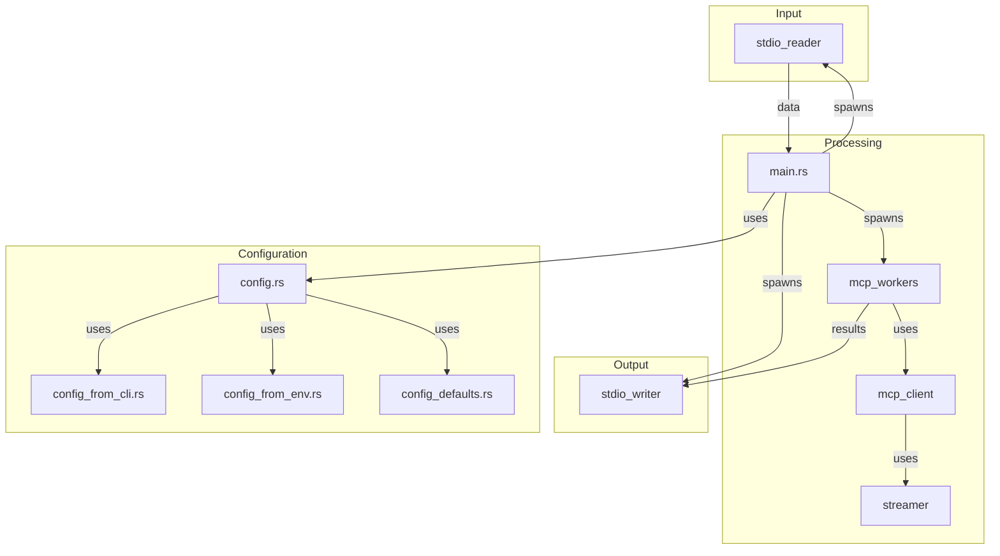

# mcp-stdio-wrapper

This project appears to be a pipeline-oriented command-line tool designed to process data. It reads input from standard in (`stdin`), processes this data concurrently using a system of workers, and then writes the results to standard out (`stdout`).

The core functionality involves an `McpStreamClient` (likely defined in `src/streamer.rs`) which is used by `mcp_workers.rs` to send processed data to an external service. It also seems to handle receiving Server-Sent Events (SSE) in response from this external service. The application's configuration is managed through `src/config.rs`, which integrates settings from command-line arguments and environment variables.

## Collaboration Diagram

Here is a high-level overview of the module collaboration:

